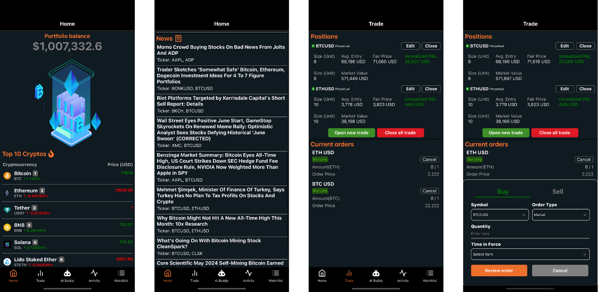

# Trade Buddy AI

## Table of Contents

- [Trade Buddy AI](#trade-buddy-ai)
  - [Table of Contents](#table-of-contents)
  - [Features](#features)
  - [Technologies Used](#technologies-used)
  - [Installation](#installation)

Trade Buddy AI is a stock and cryptocurrency trading app designed to leverage AI capabilities for analyzing market conditions. The app is built using React Native and integrates with both the OpenAI API and Alpaca API. It offers a streamlined and efficient order-placing feature and includes an AI Buddy functionality.

[](https://imgur.com/OHlktH3)

## Features

  **Order Placement**: Trade Buddy AI provides a fast and user-friendly interface for placing orders in the stock and cryptocurrency markets.

  **AI Buddy Analysis**: The AI Buddy feature utilizes AI to analyze market conditions. It gathers data from news sources and technical analysis (TA) provided by renowned traders on Twitter (now X).

  **Candle Chart Visualization**: AI Buddy can visualize candle charts and graphs, offering detailed technical analysis insights to users.

## Technologies Used

  **React Native**: The app is built using React Native, ensuring a smooth and responsive user experience across platforms.
  
  **OpenAI API**: Trade Buddy AI leverages the OpenAI API for advanced natural language processing and market analysis.
  
  **Alpaca API**: The app integrates with the Alpaca API for seamless order placement and market data retrieval.

## Installation

To run Trade Buddy AI locally, follow these steps:

**Clone the repository:**

```bash
git clone https://github.com/hieunht97/trade-buddy-ai.git
```

**Navigate to the project directory:**

```bash
cd trade-buddy-ai
```

**Install dependencies:**

```bash
npm install
```

**Start the development server:**

```bash
npm start
```

**Modify ```.env``` file:**

Go to ```.env``` file and add Alpaca API key ID and secret (You can get them by signing up for free [here](https://alpaca.markets/)), and OpenAI API key (sign up and top up balance [here](https://platform.openai.com/))